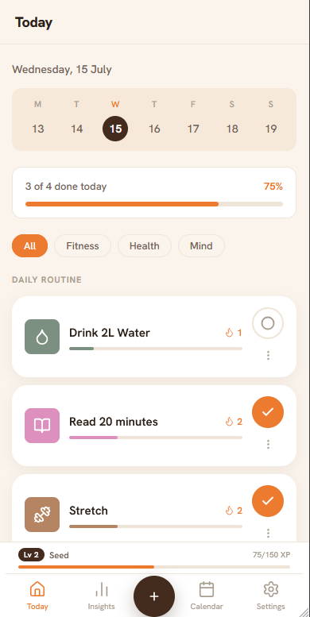
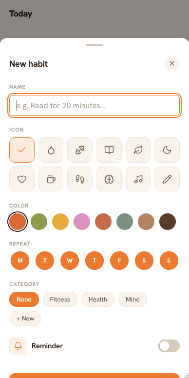
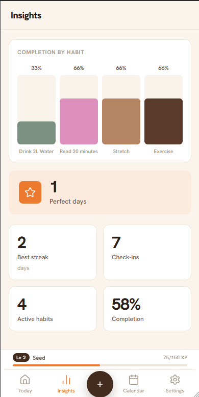
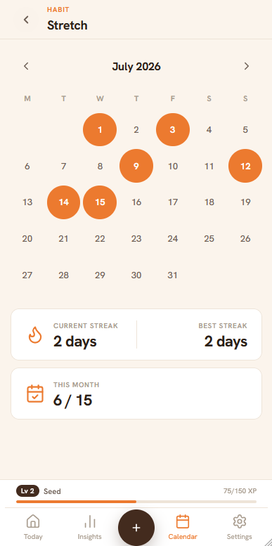
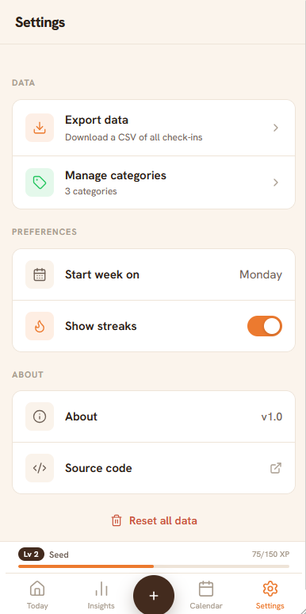
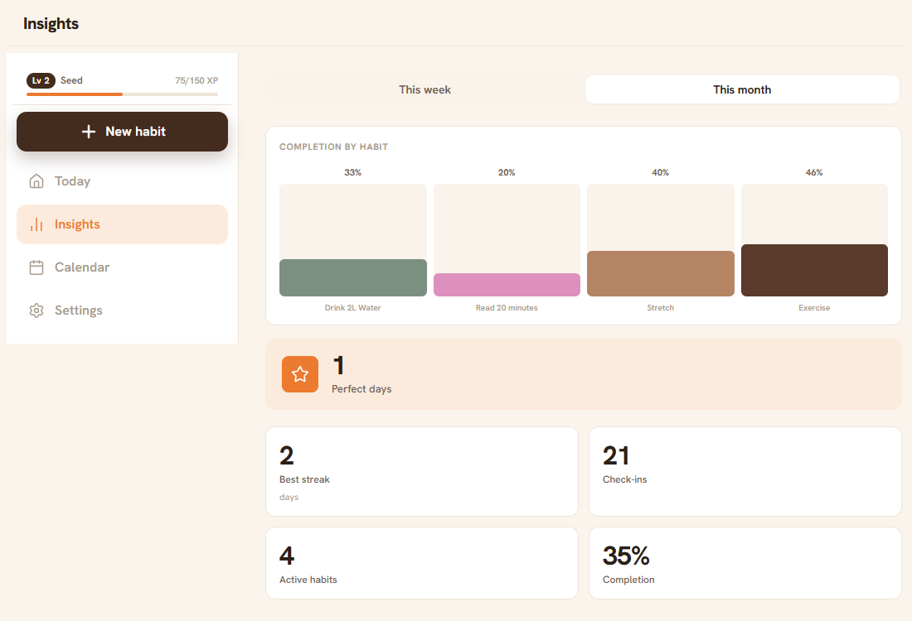

# Habit Tracker

A habit tracker I built with Flask and SQLite. You add the habits you want to keep up with, check them off each day, and watch your streaks and XP grow over time. Each browser gets its own private data, so there's no login and nothing to sign up for.

**Try it here:** https://xtekkis.pythonanywhere.com/

## Screenshots

| Today | Add habit | Insights |
|-------|-----------|----------|
|  |  |  |

| Calendar | Settings | Desktop |
|----------|----------|---------|
|  |  |  |

## What it does

- Check off your habits for the day and keep a running streak going for each one
- Earn XP every time you log a habit, with a bonus for finishing everything scheduled that day, and level up through ranks from Seed to Evergreen
- See how you're doing on the Insights page, with a weekly and monthly breakdown
- Browse any habit's full history on its own calendar, including current and best streaks
- Pick an icon and colour for each habit so they're easy to tell apart at a glance
- Group habits into categories and filter the day's list by them
- Set a daily reminder time per habit. These use browser notifications and only fire while the app is open, so if one passes while it's closed you'll see it the next time you open the app
- Export all your check-ins to CSV whenever you want
- Install it as an app on your phone or desktop, since it's a PWA that works offline
- Works nicely on mobile and switches to a two-column layout on wider screens

## Running it locally

You'll need Python 3.9 or newer.

```bash
git clone https://github.com/xtekkis/habit-tracker.git
cd habit-tracker

python -m venv venv
venv\Scripts\activate       # Windows
# source venv/bin/activate  # macOS / Linux

pip install -r requirements.txt
python app.py
```

Then open http://localhost:5000 in your browser. The database file (`habits.db`) is created for you on the first run, so there's nothing else to set up.

## Built with

| Layer | Technology |
|-------|------------|
| Backend | Python and Flask |
| Database | SQLite |
| Templates | Jinja2 |
| Styling | Plain CSS, no frameworks or build step |
| Frontend | Vanilla JavaScript |
| Icons | Lucide |
| Font | Hanken Grotesk |
